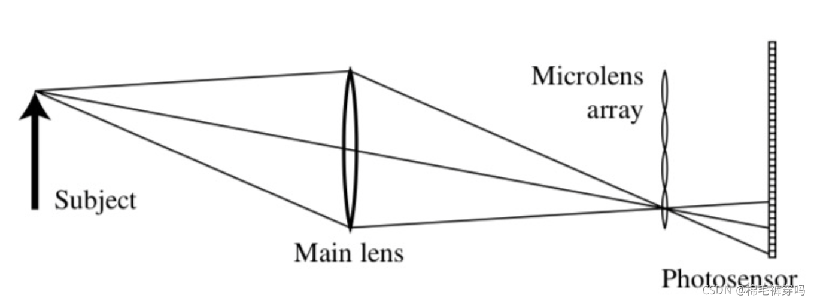

---

title: 光场基础
description: 一些零零散散的光场基础知识
categories:
 - 光场
tags: Lightfield
---

## 概念

首先 光场（Light Field） 类似 磁场 电场 就是光在我们身边传来传去形成的一个场。

百度百科： 光在每一个点通过的光量。(由法拉第定义)

也可理解为：三维空间所有光线的集合。

## 作用

我们可以看到传统二维成像

$ I(s, t) = \iint L(u,v,s,t)dudv$

每个像素点只记录了光线强度

而光场图像成像

 

$ E_{F}(x,y) = \frac{1}{F^2}\iint L_F(u,v,x,y)A(u,v)cos^4\theta dudv$

包含了位置信息和角度信息

所以光场图像可以更好地捕捉真实场景中的信息，现在很多电影都用了光场/反射场 来渲染 才得到比较逼真的各种人啊物啊。

## 表示

一开始的时候是用一个7维函数代表光场的。

但其实我们可以假设我们的波长和时间是不变的，也就是把波长独立的记录在不同的颜色通道，时间序列记录动态光场的不同帧，就可以把全光函数降成五维。也就是去掉 $ \lambda$ 和 $t$ 。

再后来，又有一个牛人提出了四维函数来表示光场。

用两个平面来表示光线 。(详见作用中第二张图)

用光穿过的两个不重合的平面的位置信息 来表示光线。图中uv面表示镜头面，xy面表示成像面。当然这里的前提是光在传播过程中波长不变且不发生衰减。其中坐标uv来表示光线的位置信息，xy来表示角度信息。

哎当然如果跟着两个平面完全平行的光线其实是没办法用这个方程表示的。但资料显示，跟人眼垂直的光线并不会被人眼所接受到。

## 与普通相机成像区别

一般的普通相机是由透镜和传感器组成的。

利用的是在小孔成像的基础上的改进版透镜成像原理，因为小孔成像中孔越小成像越清晰，可光量就会随之减小。如果小孔直径足够小，跟光的波长相当时，还会发生衍射。透镜成像就可以保证一定的通光量。小孔成像与透镜成像对比如下图。

但计算成像的时候，传统相机只记录像点及其对应的光强信息，丢失了光从进入镜头直到像点这个过程的轨迹。

于是光场相机就站出来了！它在我们传统相机的基础上，实现了对光线轨迹的记录。大家看图！

 我们可以看到光场相机在传统相机的基础上，在传感器前增加了微透镜。每个微透镜单元将主透镜成像到传感器上面形成一个宏元素。

